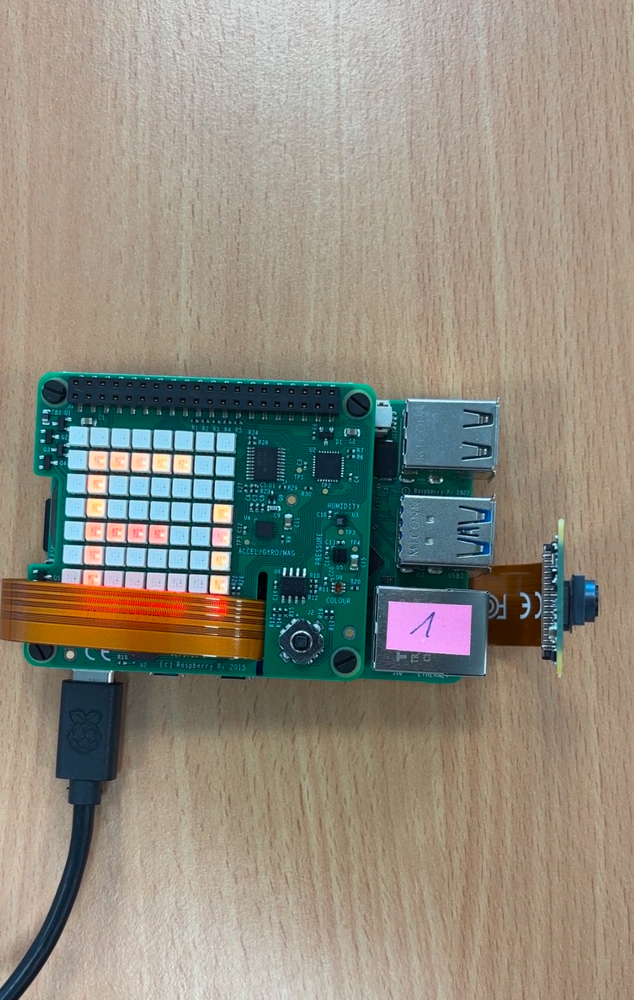
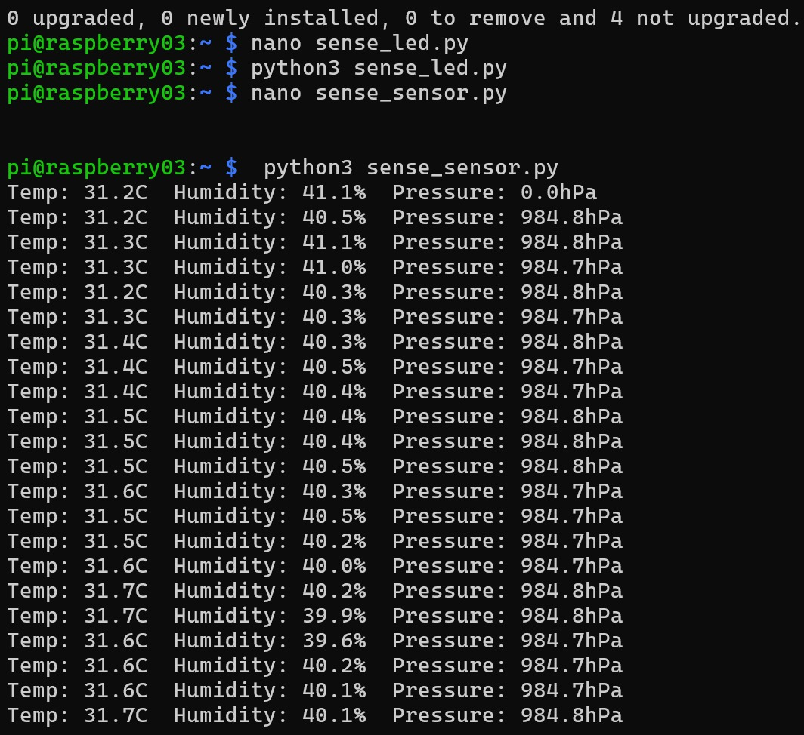

# Sensor-Interfacing-with-Raspberry-Pi
<h1>Introduction</h1>
In this lab we will use the Pi SensorHAT interfacing using the Raspberry Pi 5.
<h1>Sample Images</h1>
LED Message Example:

 
 
Sens HAT Example:

<h1>Instructions</h1>
1.Connect the Pi SenseHAT to the RaspBerryPi  
2.Connect to the Raspberry Pi using SSH  
3.Upload the code to the Pi using scp command  
4.Run the code to get the output 

<h1>Conclusion</h1>
This lab focused on sensor interfacing using the <b>Raspberry Pi 5 and Sense HAT</b>. The primary goals were to control the LED matrix to display messages and retrieve real-time environmental data (temperature, humidity, and pressure) using Python. These tasks are foundational for embedded AI and robotics applications.
